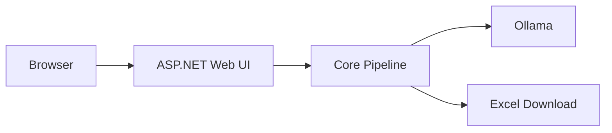

# LocalInvoiceExtractor

A privacy-first invoice extraction tool built with .NET 10, Docker and local Large Language Models (LLMs).

LocalInvoiceExtractor processes PDF invoices locally, extracts structured data using a local AI model, validates the results and exports them to Microsoft Excel.

No cloud services. No external APIs. No sensitive invoice data leaves your machine.

---

## Features

* Extract invoice data from PDF documents
* Local AI processing using Ollama
* Export results to Excel (.xlsx)
* Optional CSV export
* Dynamic field mapping via JSON configuration
* Multiple invoice types
* Confidence scoring and validation
* Docker-ready deployment
* Cross-platform support (Windows, Linux, macOS)

---

## Architecture

```text
PDF
 ↓
Text Extraction
 ↓
Prompt Builder
 ↓
Local LLM (Ollama)
 ↓
Structured JSON
 ↓
Validation & Confidence Score
 ↓
Excel Export (.xlsx)
```

The JSON output is used internally as a structured exchange format between the AI model and the application.

---

## Technology Stack

### Backend

* .NET 10
* C#

### AI

* Ollama
* Qwen 3 8B (default)
* Llama 3.1 8B (optional)

### PDF Processing

* PdfPig

### Excel Export

* ClosedXML

### Console Experience

* Spectre.Console

### Optional Web UI

* ASP.NET Core Minimal API

---

## Privacy First

All processing happens locally.

```text
Your PDFs
    ↓
LocalInvoiceExtractor
    ↓
Local LLM
    ↓
Excel
```

No invoice data is transmitted to external cloud providers.

---

## Supported Invoice Types

### Current

* Amazon

### Planned

* eBay
* Otto
* MediaMarkt
* Generic PDF invoices
* Custom document templates

---

## Example Configuration

```json
{
  "type": "amazon",
  "fields": [
    "invoice_date",
    "invoice_number",
    "order_number",
    "seller",
    "item_description",
    "net_amount",
    "tax_amount",
    "gross_amount"
  ],
  "outputFormat": "xlsx"
}
```

---

## Example Workflow

```bash
localinvoiceextractor \
  --input ./pdfs \
  --config ./configs/amazon.json \
  --output ./out/invoices.xlsx
```

---

## Output Formats

### Excel (.xlsx)

Primary output format.

Benefits:

* Native Excel support
* Filtering and sorting
* Multiple worksheets
* Formatting and validation reports
* Suitable for accounting workflows

### CSV

Optional export format for integration scenarios.

### JSON

Optional technical output for:

* Debugging
* Validation
* Future API integrations
* Training dataset generation

Example:

```json
{
  "invoice_date": "2026-05-12",
  "gross_amount": 99.99,
  "tax_amount": 15.97,
  "seller": "Amazon EU S.à r.l."
}
```

---

## Confidence Scoring

Every processed invoice receives a confidence score.

The score is calculated using:

* Required fields found
* Valid JSON response
* Tax consistency checks
* Amount validation
* Date validation
* Source text verification
* Missing field detection

Example:

```json
{
  "invoice_number": "12345",
  "gross_amount": 99.99,
  "confidence": 0.94,
  "status": "OK"
}
```

Status values:

* OK
* CHECK
* FAILED

---

## Deployment Architecture

### Development

```text
C# Application
        │
        ▼
Ollama Container
        │
        ▼
Qwen 3 8B
```

### Production

```text
Docker Compose

├── LocalInvoiceExtractor
└── Ollama
```

The application communicates with Ollama through a local HTTP API.

---

## Roadmap

### V1

* Amazon invoice extraction
* PDF → JSON → Excel
* Local LLM integration
* Confidence scoring

### V2

* Multiple invoice types
* Improved validation engine
* CSV export

### V3

* Docker deployment
* Drag & Drop Web UI

### V4

* User correction workflow
* Training dataset generation

### V5

* REST API
* Batch processing
* Additional document types

---

## Project Goals

LocalInvoiceExtractor aims to provide a simple, privacy-friendly and extensible framework for extracting structured data from invoices and business documents using local AI models.

The project is designed to:

* Run completely offline
* Remain independent of cloud AI providers
* Support multiple invoice formats
* Produce high-quality structured output
* Be easily deployable using Docker

---

## Architecture


## Deployment

## Future Web Architecture


## Vision

```text
PDF
 ↓
Local AI
 ↓
Structured Data
 ↓
Excel / CSV / JSON
```

A lightweight and extensible framework for local document intelligence.
